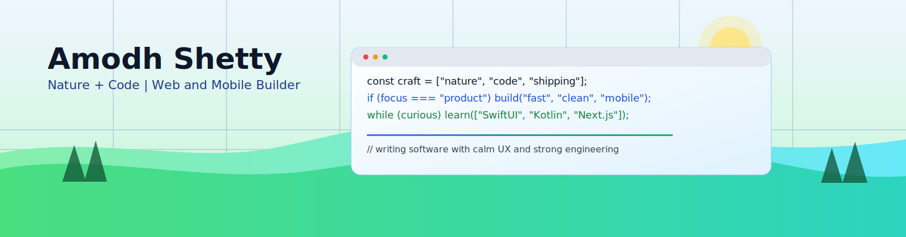

<p align="center">
  <picture>
    <source media="(prefers-color-scheme: dark)" srcset="./assets/hero-nature-code-dark.svg" />
    
  </picture>
</p>

<p align="center">
  <strong>Building calm interfaces and geeky systems that ship fast.</strong><br />
  Web and mobile product engineering with clean architecture and real-world velocity.
</p>

<p align="center">
  
  
  
  
</p>

## About

- I turn product ideas into reliable interfaces people enjoy using.
- I care about performance budgets, accessibility, and maintainable architecture.
- I build and iterate on personal products from idea to deploy.
- I work across `Next.js`, `SwiftUI`, `React Native`, and `Kotlin`.
- Favorite debugging stack: `console.log`, `git bisect`, and stubborn optimism.

<p align="center">
  
</p>

## Tech Stack

**Toolbelt**

<p align="center">
  
  
  
  
  
</p>

<details open>
  <summary><b>Languages</b></summary>
  <br />
  
  
  
  
  
  
</details>

<details open>
  <summary><b>Web</b></summary>
  <br />
  
  
  
  
  
  
</details>

<details>
  <summary><b>Mobile</b></summary>
  <br />
  
  
  
  
  
</details>

<details open>
  <summary><b>Top Language Mix (active projects)</b></summary>
  <br />
  
  
  
  
</details>

<p align="center">
  
</p>

## Now

- Building web experiences that feel fast, intentional, and calm to use.
- Expanding product depth on iOS and Android while keeping one clear UX voice.
- Tightening old codebases so future-me has fewer "why did I do that?" moments.

```ts
const now = {
  shipping: "web + mobile features",
  learning: "system design + app architecture",
  mood: "green checks > red pipelines",
};
```

<p align="center">
  
</p>

## Links

[](https://github.com/theamodhshetty)
[](https://www.linkedin.com/in/theamodhshetty/)
[](https://www.amodhshetty.com/)
